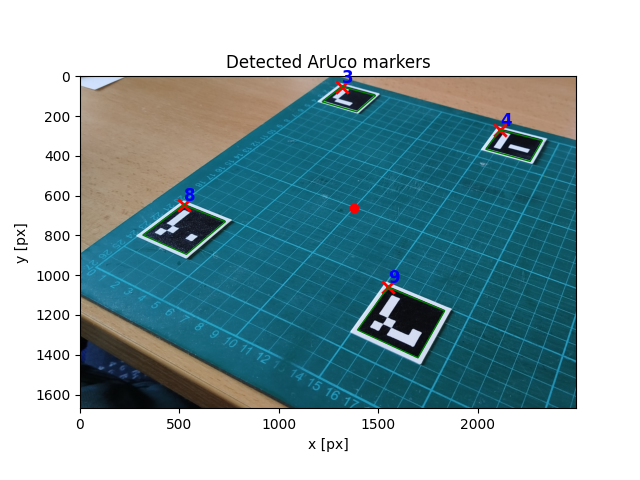
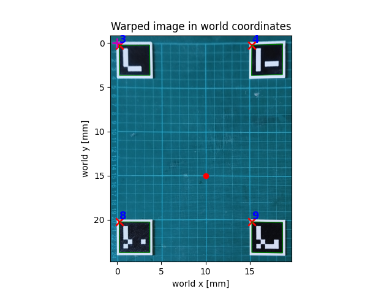

# ArUco Homography Measurement

Simple Python project for detecting ArUco markers, computing homography, and converting image coordinates into real-world coordinates.

## Features

- Detect ArUco markers
- Match markers to known world positions
- Compute homography
- Transform points between image and world space
- Warp images into world coordinates
- Visualize detections and transformed points

## Example

| Detection | Warped World View |
|---|---|
|  |  |

## Repository Structure

### `Detect.py`

ArUco detection utilities:

- generate markers: `create_marker`, `create_sample_image`
- detect markers and store IDs and corners: `detect`

Main class:

```python
Detect()
```

---

### `Measure.py`

Homography and measurement tools:
- compute homography: `compute_homography()`
- transform coordinates: `transform_point_i2w()`, `transform_point_w2i()`
- warp images: `warp_image_to_world()`
- visualize results: `plot_detection()`, `plot_world_detection()`

Main class:

```python
Measure()
```
---

### `Aruko_example.ipynb`

Example notebook demonstrating: marker detection -> homography computation -> coordinate transforms -> visualization

## Requirements

```bash
pip install opencv-python opencv-contrib-python matplotlib numpy
```

## Notes

- At least 4 known markers are required
- Marker IDs must match `WORLD_COORDS`
- Units are user-defined (`mm`, `cm`, etc.)
- Built with OpenCV ArUco module
