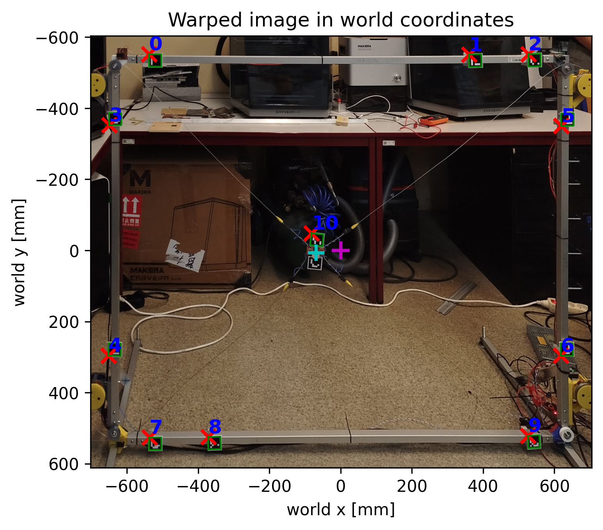
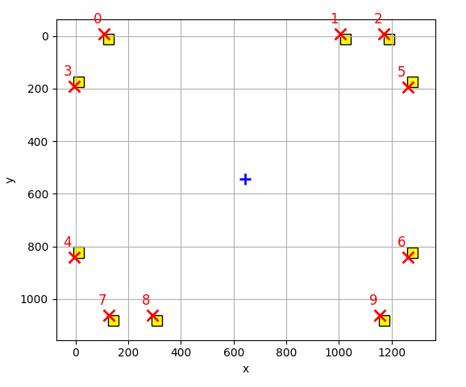

# ArUco LED Measurement

Detect ArUco markers, compute image to world homography, and localise LED position.


## Install

```bash
pip install opencv-python opencv-contrib-python matplotlib numpy
```

## Usage - Single frame

| Command                                                                        | Description                    |
|--------------------------------------------------------------------------------| ------------------------------ |
| `python measure_LED_cli.py sample.jpg`                                         | Measure LED position           |
| `python measure_LED_cli.py sample.jpg -plot -to led_plot.png`                  | Save detection plot            |
| `python measure_LED_cli.py sample.jpg -out results.csv`                        | Export coordinates to CSV      |
| `python measure_LED_cli.py sample.jpg -plot -to led_plot.png -out results.csv` | Save plot and export CSV       |
| `python measure_LED_cli.py -show_layout`                                       | Show calibration marker layout |

Example output:
```text id="9jok0q"
x=534.281921, y=482.184387
```

| Flag   | `-out results.csv`                                | `-plot -to led_plot.png`             | `-show_layout`                     |
| ------ | ------------------------------------------------- |--------------------------------------|------------------------------------|
| Output | `image,x,y`<br>`sample.jpg,534.281921,482.184387` |  |  |


## Usage - Video

Track the LED through a video, export measured world coordinates to CSV, and optionally create an annotated video with the tracked path.

| Command | Description |
|---|---|
| `python track_led_video.py input.mp4 -out results.csv -annotated tracked.mp4` | Track LED, save CSV, and render annotated video |
| `python track_led_video.py input.mp4 -out results.csv --measure-only` | Only measure video and save CSV |
| `python track_led_video.py input.mp4 -csv results.csv -annotated tracked.mp4 --draw-only` | Draw annotated video from an existing CSV |
| `python track_led_video.py input.mp4 -out results.csv -annotated tracked.mp4 --min-calibration-markers 7` | Use stricter frame filtering |
| `python track_led_video.py input.mp4 -out results.csv -annotated tracked.mp4 --include-failed` | Also keep failed frames in CSV for debugging |

| Feature | Description |
|---|---|
| Pass condition | A frame is accepted only if marker **10** or **11** is detected, and at least **6 markers** from IDs **0–9** are detected. |
| Interpolation | Frames that fail detection are skipped from normal results and interpolated from neighboring valid frames when drawing the annotated video. |
| Annotated video | Draws the tracked path with alpha `0.5`, marks the current LED position with a red `X`, and writes the current `(x, y)` coordinates in the lower corner. |
| CSV behavior | The CSV is rewritten on each run, not appended. |

| CSV column | Description |
|---|---|
| `frame` | Frame index in the input video |
| `time_s` | Frame timestamp in seconds |
| `x`, `y` | LED position in world coordinates |
| `h00`–`h22` | 3×3 image-to-world homography matrix, stored row-wise |
| `n_calibration_markers_0_9` | Number of detected calibration markers from IDs 0–9 |
| `led_marker_ids` | Detected LED marker IDs, usually `10`, `11`, or both |


## 3D Models

Printable mounting models:

* [PCB ArUco holder](https://a360.co/4nsENOI) (markers **10** and **11**)

* [20×20 mm aluminium frame ArUco holder](https://a360.co/4eDsnkG) (markers **0** to **9**)
  

Printed parts use: magnets `9.75×4.75×1.75` and `9×4.6×2.6`, screws `M3×12` and threaded inserts `M3 8×4.2 mm`


